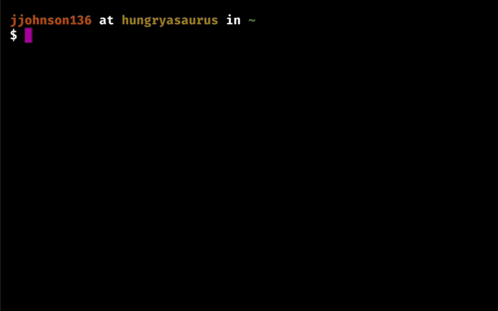

# Simple UserStore Command Line Interface (CLI) [](https://travis-ci.org/geekydatamonkey/simple-userstore-cli) [](https://www.npmjs.com/package/simple-userstore-cli)

Manage users within a [Simple UserStore](https://github.com/geekydatamonkey/simple-userstore) from the command
line.

- [x] List all users
- [x] Create a new user
- [x] Change a user's password
- [x] Change a users's username
- [x] Remove a user



## Installation

```
$ npm install -g simple-userstore-cli
```

## Usage

```
$ simple-userstore-cli

SIMPLE USERSTORE CLI

[?] Path to the database file?
>> db/apiUsers.db

Loading Database: db/apiUsers.db ... 2 entries found

[?] Choose:
  - List all users
  - Create a new user
  - Change a user's password
  - Change a user's username
  - Remove a user
  - Quit
>> Create a new user

[?] Username?
>> ebenes

[?] Password?
>> •••••••••

New user 'ebenes' created.
```

## License

MIT © [James Johnson](http://james.mn)
